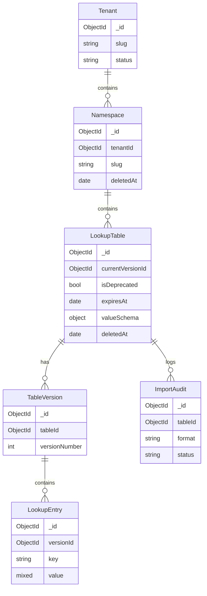

# Domain model (logical)

## Entity hierarchy

## Lifecycle sidecars

- **Deprecation:** `isDeprecated`, `deprecatedAt`, `expiresAt` on `sys_lookup_tables`. **Expiry** blocks mutations (403/410); reads/export often remain.
- **Soft delete:** `deletedAt` / `deletedBy` on `sys_namespaces` and `sys_lookup_tables`; lists default to `includeDeleted=false`.
- **Versioning:** Mutable entry APIs target **current** `sys_lookup_table_versions` row; historical reads use `versionId` query parameter.

## API resource mapping (typical)

| Resource | Mongo collection(s) |
|----------|---------------------|
| Tenant | `sys_tenants` |
| Namespace | `sys_namespaces` |
| Lookup table | `sys_lookup_tables` |
| Table version | `sys_lookup_table_versions` |
| Entry | Physical collection per version: `<tenantSlug>_<namespaceSlug>_<tableSlug>_<versionNumber>` (hyphens in slugs → `_`; see `sys_lookup_table_versions.entriesCollection`) |
| Import / bulk audit | `sys_lookup_import_audit` |
