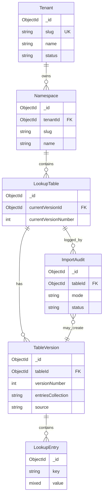

# MongoDB data model — Generic multi-tenant lookup service

This document finalizes collections, fields, compound indexes, **`valueString` / `valueType`** for search, **table versioning**, **Excel bulk import** (`sys_lookup_import_audit`), and related indexes.

**Metadata collections** use the **`sys_`** prefix so they are clearly distinct from **user lookup data** collections (per-table-version entry stores).

---

## Entity relationship (logical)

**Rules**

- Within one **lookup table version**, **`key` is unique** (same logical table can repeat keys across different immutable versions).
- **`slug`** is unique per parent scope: namespace slug per tenant; table slug per namespace.
- **Entry storage (physical):** each **table version** has its **own MongoDB collection** (not prefixed with `lookup_` or `sys_`) so large tables do not share a single unbounded `lookup_entries` namespace. The collection name is stored on **`sys_lookup_table_versions.entriesCollection`**. The name is built from tenant, namespace, and table **slugs** with **hyphens replaced by underscores**, then **`_<versionNumber>`**: **`<tenantSlug>_<namespaceSlug>_<tableSlug>_<versionNumber>`** (each slug segment uses `_` instead of `-`). Names **must not** start with **`sys_`** (reserved for metadata). The REST API still scopes requests by `tenantId` / path; the server maps to the correct physical collection via the version document.
- **`sys_lookup_tables.currentVersionId`** points at the version used for default reads and for **mutating** entry APIs. **Bulk import** either creates a **new** version (`new_version`) or **replaces** entries on the current version (`overwrite_current`); each attempt is recorded in **`sys_lookup_import_audit`**.

---

## Collection: `sys_tenants`

| Field       | Type     | Notes |
|------------|----------|--------|
| `_id`      | ObjectId | Primary key |
| `slug`     | string   | Unique across tenants |
| `name`     | string   | Display name |
| `status`   | string   | `active` \| `suspended` |
| `metadata` | object   | Optional arbitrary JSON |
| `createdAt`| date     | |
| `updatedAt`| date     | |

**Indexes**

| Keys | Options | Purpose |
|------|---------|---------|
| `{ slug: 1 }` | **unique** | Tenant slug lookup |

**Migrations**

- Add `createdAt` / `updatedAt` defaults in application or via `$currentDate` on insert.
- Prefer **soft delete** (`status: deleted` or `deletedAt`) if retention is required; adjust unique slug with a suffix or tombstone pattern if slugs must be reused.

---

## Collection: `sys_namespaces`

| Field         | Type     | Notes |
|---------------|----------|--------|
| `_id`         | ObjectId | |
| `tenantId`    | ObjectId | Required; references `sys_tenants._id` |
| `slug`        | string   | Unique **per** `tenantId` |
| `name`        | string   | |
| `description` | string   | Optional |
| `deletedAt`   | date     | Null when active; soft-delete timestamp |
| `deletedBy`   | string   | JWT `sub` when soft-deleted |
| `createdAt`   | date     | |
| `updatedAt`   | date     | |

**Indexes**

| Keys | Options | Purpose |
|------|---------|---------|
| `{ tenantId: 1, slug: 1 }` | **unique** | Enforce slug per tenant |
| `{ tenantId: 1, _id: 1 }` | | List namespaces by tenant |
| `{ tenantId: 1, deletedAt: 1 }` | optional | List active vs deleted |

---

## Collection: `sys_lookup_tables`

| Field         | Type     | Notes |
|---------------|----------|--------|
| `_id`         | ObjectId | |
| `tenantId`    | ObjectId | Denormalized |
| `namespaceId` | ObjectId | |
| `slug`        | string   | Unique per namespace |
| `name`        | string   | |
| `description` | string   | Optional |
| `currentVersionId` | ObjectId | Required after create; points to active `sys_lookup_table_versions` row |
| `currentVersionNumber` | int | Denormalized for list UI |
| `versionCounter` | int | Optional; atomic increment when allocating `versionNumber` |
| `isDeprecated` | bool | Default `false`; explicit deprecation flag |
| `deprecatedAt` | date | Null when not deprecated; set when first marked deprecated |
| `expiresAt` | date | Null = no scheduled sunset; after this instant, **mutating** APIs should reject (see OpenAPI) |
| `valueSchema` | object | Optional JSON Schema (draft 2020-12) for **`value`**; max ~32 KB BSON |
| `deletedAt` | date | Null when active; soft-delete on table |
| `deletedBy` | string | JWT `sub` when soft-deleted |
| `createdAt`   | date     | |
| `updatedAt`   | date     | |

**Deprecation rules**

- If `expiresAt` is set and `deprecatedAt` is set, require **`expiresAt` >= `deprecatedAt`** on write.
- If `isDeprecated` is `true` and `expiresAt` is **null**, the table is deprecated with **no fixed expiry** (warnings only; **default API: `isDeprecated` alone does not block writes**).
- Deprecation does **not** delete `sys_lookup_table_versions` or **drop** per-version entry collections; it is lifecycle metadata only.

**`isExpired` (API read-only) and `hideExpired` list filter**

- **`isExpired`:** `true` iff **`expiresAt != null`** and **server now (UTC) >= `expiresAt`**. If **`expiresAt`** is null, **`isExpired`** is always **`false`** (even if `isDeprecated`).
- **`GET .../tables?hideExpired=true`:** omit rows where **`expiresAt != null`** and **now (UTC) >= `expiresAt`** (same predicate as **`isExpired`**).

**`valueSchema` validation**

- When non-null: validate **`value`** on single entry write, **`POST .../entries/bulk`**, and optionally relaxed validation for Excel strings (product choice). Fail with **422** `VALIDATION_ERROR` and pointers in `details`.

**Soft delete (namespaces and tables)**

- **`DELETE`** with `permanent=false` (default): set **`deletedAt`** / **`deletedBy`**; hide from list when **`includeDeleted=false`**.
- **`POST .../restore`:** clear soft-delete fields when within retention policy.
- **`permanent=true`:** hard-delete cascade (`platform_admin` only).

**Excel worksheet**

- Default sheet: **first worksheet** in workbook order. Optional **`sheetName`** selects by name; error if missing.

**Indexes**

| Keys | Options | Purpose |
|------|---------|---------|
| `{ tenantId: 1, namespaceId: 1, slug: 1 }` | **unique** | Table slug per namespace |
| `{ tenantId: 1, namespaceId: 1 }` | | List tables in namespace |
| `{ tenantId: 1, namespaceId: 1, expiresAt: 1 }` | optional | Jobs listing tables with upcoming expiry (do **not** use TTL on `expiresAt` unless documents are truly removed) |

**Table create lifecycle**

- Insert `sys_lookup_tables` and initial `sys_lookup_table_versions` (`versionNumber: 1`, `source: manual`, **`entriesCollection`** set to `<tenantSlug>_<namespaceSlug>_<tableSlug>_1` with slug hyphen→underscore rules) in one transaction; set `currentVersionId` / `currentVersionNumber`.
- Create indexes on the new **`entriesCollection`** (unique `key`, `valueString`, `_id` for pagination).

---

## Collection: `sys_lookup_table_versions`

Immutable **version** metadata for a logical table. Entry rows for this version live in the physical collection named **`entriesCollection`** (not in a shared global entries collection).

| Field               | Type     | Notes |
|---------------------|----------|--------|
| `_id`               | ObjectId | |
| `tenantId`          | ObjectId | Denormalized |
| `tableId`           | ObjectId | |
| `versionNumber`     | int      | Monotonic per `tableId` |
| `entriesCollection` | string   | MongoDB collection name: `<tenantSlug>_<namespaceSlug>_<tableSlug>_<versionNumber>` (hyphens in slugs → `_`; must not start with `sys_`) |
| `label`             | string   | Optional (e.g. release label) |
| `createdAt`         | date     | |
| `createdBy`         | string   | JWT `sub` |
| `source`            | string   | `manual` \| `bulk_upload` \| `copy` |
| `importAuditId`     | ObjectId | Nullable; set when row created by an import |
| `entryCount`        | int      | Denormalized count of rows in **entriesCollection** |

**Indexes**

| Keys | Options | Purpose |
|------|---------|---------|
| `{ tableId: 1, versionNumber: 1 }` | **unique** | Monotonic version per table |
| `{ tenantId: 1, tableId: 1, _id: -1 }` | | List versions newest-first |

---

## Collection: `sys_lookup_import_audit`

One document per **bulk import attempt** (success, failure, or partial).

| Field               | Type     | Notes |
|---------------------|----------|--------|
| `_id`               | ObjectId | |
| `tenantId`          | ObjectId | |
| `tableId`           | ObjectId | |
| `actorSub`          | string   | JWT `sub` |
| `filename`          | string   | Original upload name; null / placeholder for **`format: json`** |
| `fileSize`          | int      | Bytes; null for json bulk |
| `sha256`            | string   | Optional file hash |
| `mode`              | string   | `new_version` \| `overwrite_current` |
| `format`            | string   | `wide` \| `kv` \| **`flat_object`** \| **`json`** (JSON bulk upsert) |
| `status`            | string   | `pending` \| `running` \| `succeeded` \| `failed` \| `partial` |
| `startedAt`         | date     | |
| `completedAt`       | date     | Nullable until finished |
| `previousVersionId` | ObjectId | Nullable; snapshot before overwrite (often equals current before job) |
| `resultingVersionId`| ObjectId | Version that received writes (new id for `new_version`, else current) |
| `stats`             | object   | e.g. `{ keysParsed, entriesWritten, warningsCount, errorsCount }` |
| `details`           | array    | `{ code, message, cell?, key? }` (cell e.g. `Sheet1!B2`) |

**Indexes**

| Keys | Options | Purpose |
|------|---------|---------|
| `{ tenantId: 1, tableId: 1, startedAt: -1 }` | | Audit list in UI |

**Excel parsing (v1)**

- **wide:** Row 1 = keys (headers), row 2 = string values; skip empty cells with optional warnings. **Default worksheet:** first in file order; override by **`sheetName`**.
- **kv:** Columns `Key` / `Value`, multiple rows (same sheet rules).
- **flat_object:** Row 1 = **`key`** + one column per top-level field of object **`value`** (union of keys across rows, export order is sorted) + optional **`_scalar`**. Each further row is one entry: object fields in named columns; non-object **`value`** (primitive, array, etc.) is encoded in **`_scalar`** (`JSON.parse` on import when appropriate). Nested sub-objects under a top-level key may be stored as JSON text in that cell.
- **json:** No file; corresponds to **`POST .../entries/bulk`** payload (audit row only).
- **wide** / **kv:** ingest as **strings** unless Excel supplies numeric cell types. **`flat_object`** preserves numbers/booleans from cells where Excel provides them. Validate every row against **`valueSchema`**.

**Implementation**

- Use a **transaction** for `overwrite_current`: `deleteMany({})` on the **current version’s `entriesCollection`**, then bulk insert parsed entries into that same collection.
- For `new_version`: allocate `versionNumber`, set **`entriesCollection`**, create indexes on that new collection, insert version doc, insert entries, update `sys_lookup_tables.currentVersionId` (when policy makes new version current).
- Stream-parse `.xlsx` to cap memory; enforce max file size; **rate-limit** imports per tenant.

---

## Per-version entry collections (replaces a single `lookup_entries` collection)

Each **`sys_lookup_table_versions`** row points at a **dedicated MongoDB collection** via **`entriesCollection`**.

**Naming (reference implementation)**

`<tenantSlug>_<namespaceSlug>_<tableSlug>_<versionNumber>` where each slug has **`-` replaced with `_`** (API slugs may still use hyphens).

Example: slugs `demo-tenant`, `demo-ns`, `demo-table`, version `1` → `demo_tenant_demo_ns_demo_table_1`.

Example: slugs `acme`, `sales`, `regions`, version `3` → `acme_sales_regions_3`.

**Slug / length constraints:** MongoDB collection names are limited in length (~120 bytes in many deployments). Very long slugs can exceed the limit; implementations should validate or hash if needed.

**Document shape** (within each `entriesCollection`)

| Field         | Type     | Notes |
|---------------|----------|--------|
| `_id`         | ObjectId | |
| `key`         | string   | **Unique** within this collection |
| `value`       | any BSON | JSON-serializable payload |
| `valueString` | string   | Nullable; see strategy below |
| `valueType`   | string   | `string` \| `number` \| `bool` \| `object` \| `array` \| `null` \| `binData` \| … |
| `createdAt`   | date     | |
| `updatedAt`   | date     | |

`tenantId` / `namespaceId` / `tableId` / `versionId` are **not** stored on each entry row; the API layer adds them when serializing responses.

### `valueString` and `valueType` strategy (final)

**On every insert/update** of `value`, the application **recomputes**:

1. **`valueType`** — derived from BSON type of `value` (string, double/int, bool, object, array, null, etc.).
2. **`valueString`** — normalized for search:
   - If `value` is a **string**: `valueString = value` (optionally apply a max length, e.g. 16 KB, and reject or truncate per product policy).
   - If `value` is **number / bool / null**: set `valueString` to a **canonical string** (e.g. `String(value)`, `true`/`false`, empty for nullable) **only if** you want **exact** value queries across types; otherwise leave `valueString` **null** and restrict **value search** to string entries only (simpler).
   - If `value` is **object or array**: **`valueString = null`** in the reference implementation. **Nested field search** uses MongoDB **dot paths** on the stored **`value`** document (e.g. `value.text`, `value.description`) via **`valuePath`** on **`GET .../entries`**, via legacy **`filters`** on **`POST .../entries/search`**, or via a **`valuePath`** leaf inside the boolean **`query`** tree on **`POST .../entries/search`** (see OpenAPI). Optional: product could set `valueString = JSON.stringify(value)` for whole-document text match (not implemented in the reference API).

**Recommended default for a generic product**

- **`valueString`**: set for **scalar string** values only; **null** for object/array (and other non-string scalars unless you add canonical string projection).
- **API (root primitive):** without **`valuePath`**, **`valueMatch=partial`** applies only when `valueType === "string"` (and `valueString` is populated).
- **API (nested object):** use **`valuePath`** + **`value`** on **`GET .../entries`**, or **`POST .../entries/search`** with legacy **`filters`** (each filter runs **regex or equality** on `value.<path>` for **string** leaves), or **`POST .../entries/search`** with a **`query`** tree using **`valuePath`** leaves. Non-string BSON at that path may yield no matches.

**`POST .../entries/search` — boolean `query` tree (reference API)**

- When the request body includes **`query`**, legacy **`filters`** / top-level filter fields are **not** used for filtering.
- **Branches:** `{ "op": "and" | "or", "clauses": [ ... ] }` (nested).
- **Leaves:** **`keyExact`**, **`keyPrefix`**, **`valueRoot`**, **`valuePath`** (see OpenAPI for full JSON shapes and **`match`:** `exact` \| `partial`).
- **`valueRoot`:** matches the indexed **`valueString`** field (meaningful when the entry’s root **`value`** is a **string**); **`partial`** requires **`valueType: string`**. Does **not** search inside nested object properties — use **`valuePath`** for those.

**Partial / exact value search (implementation)**

- **Root string** (`value` is string): `valueString` + `valueType: string` for legacy list filters.
- **Nested string fields** (`value` is object): query `value.<segment>.<…>` with escaped regex (**partial**) or string equality / case-insensitive regex (**exact**). Path segments are restricted to safe identifiers (see OpenAPI).
- **Partial** on strings: MongoDB **regex** escape user input; use `caseSensitive` to toggle `i` flag. Queries run **only** inside the target version’s **`entriesCollection`**.
- **Performance**: arbitrary substring regex **does not** use a normal B-tree index efficiently on arbitrary nested paths; add **compound indexes** on hot `value.<field>` fields if needed, or plan **Atlas Search** for full-text.

**Indexes (created per `entriesCollection` when the version is created)**

| Keys | Options | Purpose |
|------|---------|---------|
| `{ key: 1 }` | **unique** | Unique key within this version |
| `{ valueString: 1 }` | | `valueString` filtering |
| `{ _id: 1 }` | | Keyset / sorted pagination |

**Cursor pagination:** list entries with **`_id` ascending**; client passes last seen **`_id`** as opaque cursor (see OpenAPI `cursor` / `meta.nextCursor`).

**Hard delete / cascade:** dropping a table or namespace should **`drop()`** each version’s **`entriesCollection`** (in addition to deleting metadata documents).

---

## Why not embed entries in `sys_lookup_tables`?

Embedded arrays are limited by the **16 MB** document cap, make **unique key** enforcement difficult, and complicate **partial value** queries. **Dedicated collections per table version** keep CRUD + search isolated and avoid one giant shared collection.

---

## Migration notes

0. **Breaking rename (metadata):** `tenants` → `sys_tenants`, `namespaces` → `sys_namespaces`, `lookup_tables` → `sys_lookup_tables`, `lookup_table_versions` → `sys_lookup_table_versions`, `lookup_import_audit` → `sys_lookup_import_audit` (e.g. `renameCollection` per database). **User entry collections:** remove the former `lookup_` prefix and replace **`-` with `_`** inside each slug segment; update **`sys_lookup_table_versions.entriesCollection`** accordingly (safest: recompute from current tenant/namespace/table slugs and `versionNumber`, then `renameCollection` on the physical data collection if names change).
1. Create indexes in **production** with `{ background: true }` on older MongoDB versions if applicable; on MongoDB 4.2+ index builds are generally non-blocking for reads.
2. Backfill **`valueString` / `valueType`** for existing rows with a one-off script before enabling strict search in production.
3. **Migrating from a monolithic `lookup_entries` collection:** for each distinct `(tenantId, tableId, versionId)` group, create the per-version **`entriesCollection`**, create indexes, copy documents (stripping redundant `tenantId` / `namespaceId` / `tableId` / `versionId` fields if desired), set **`sys_lookup_table_versions.entriesCollection`**, then drop the old shared collection when empty.
4. Deleting a **namespace** or **table**: **cascade delete** `sys_lookup_table_versions`, **drop** each **`entriesCollection`**, and delete `sys_lookup_import_audit` rows for that table (or soft-delete with tombstones per product policy).
