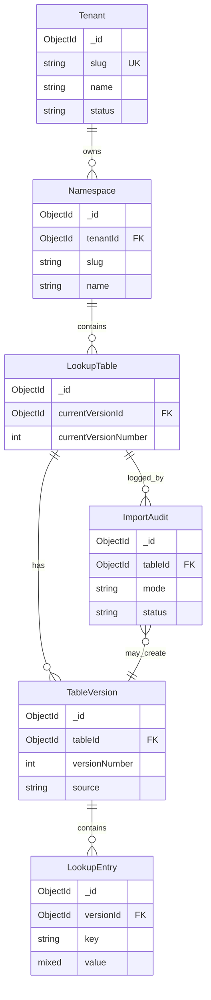

# MongoDB data model — Generic multi-tenant lookup service

This document finalizes collections, fields, compound indexes, **`valueString` / `valueType`** for search, **table versioning**, **Excel bulk import** (`lookup_import_audit`), and related indexes.

---

## Entity relationship (logical)

**Rules**

- Within one **lookup table version**, **`key` is unique** (same logical table can repeat keys across different immutable versions).
- **`slug`** is unique per parent scope: namespace slug per tenant; table slug per namespace.
- **`tenantId`** (and optionally `namespaceId`) are **denormalized** onto `lookup_entries` so every query can filter by tenant in one collection scan with no logical “join”.
- **`lookup_tables.currentVersionId`** points at the version used for default reads and for **mutating** entry APIs. **Bulk import** either creates a **new** version (`new_version`) or **replaces** entries on the current version (`overwrite_current`); each attempt is recorded in **`lookup_import_audit`**.

---

## Collection: `tenants`

| Field       | Type     | Notes |
|------------|----------|--------|
| `_id`      | ObjectId | Primary key |
| `slug`     | string   | Unique across tenants |
| `name`     | string   | Display name |
| `status`   | string   | `active` \| `suspended` |
| `metadata` | object   | Optional arbitrary JSON |
| `createdAt`| date     | |
| `updatedAt`| date     | |

**Indexes**

| Keys | Options | Purpose |
|------|---------|---------|
| `{ slug: 1 }` | **unique** | Tenant slug lookup |

**Migrations**

- Add `createdAt` / `updatedAt` defaults in application or via `$currentDate` on insert.
- Prefer **soft delete** (`status: deleted` or `deletedAt`) if retention is required; adjust unique slug with a suffix or tombstone pattern if slugs must be reused.

---

## Collection: `namespaces`

| Field         | Type     | Notes |
|---------------|----------|--------|
| `_id`         | ObjectId | |
| `tenantId`    | ObjectId | Required; references `tenants._id` |
| `slug`        | string   | Unique **per** `tenantId` |
| `name`        | string   | |
| `description` | string   | Optional |
| `deletedAt`   | date     | Null when active; soft-delete timestamp |
| `deletedBy`   | string   | JWT `sub` when soft-deleted |
| `createdAt`   | date     | |
| `updatedAt`   | date     | |

**Indexes**

| Keys | Options | Purpose |
|------|---------|---------|
| `{ tenantId: 1, slug: 1 }` | **unique** | Enforce slug per tenant |
| `{ tenantId: 1, _id: 1 }` | | List namespaces by tenant |
| `{ tenantId: 1, deletedAt: 1 }` | optional | List active vs deleted |

---

## Collection: `lookup_tables`

| Field         | Type     | Notes |
|---------------|----------|--------|
| `_id`         | ObjectId | |
| `tenantId`    | ObjectId | Denormalized |
| `namespaceId` | ObjectId | |
| `slug`        | string   | Unique per namespace |
| `name`        | string   | |
| `description` | string   | Optional |
| `currentVersionId` | ObjectId | Required after create; points to active `lookup_table_versions` row |
| `currentVersionNumber` | int | Denormalized for list UI |
| `versionCounter` | int | Optional; atomic increment when allocating `versionNumber` |
| `isDeprecated` | bool | Default `false`; explicit deprecation flag |
| `deprecatedAt` | date | Null when not deprecated; set when first marked deprecated |
| `expiresAt` | date | Null = no scheduled sunset; after this instant, **mutating** APIs should reject (see OpenAPI) |
| `valueSchema` | object | Optional JSON Schema (draft 2020-12) for **`value`**; max ~32 KB BSON |
| `deletedAt` | date | Null when active; soft-delete on table |
| `deletedBy` | string | JWT `sub` when soft-deleted |
| `createdAt`   | date     | |
| `updatedAt`   | date     | |

**Deprecation rules**

- If `expiresAt` is set and `deprecatedAt` is set, require **`expiresAt` >= `deprecatedAt`** on write.
- If `isDeprecated` is `true` and `expiresAt` is **null**, the table is deprecated with **no fixed expiry** (warnings only; **default API: `isDeprecated` alone does not block writes**).
- Deprecation does **not** delete `lookup_table_versions` or `lookup_entries`; it is lifecycle metadata only.

**`isExpired` (API read-only) and `hideExpired` list filter**

- **`isExpired`:** `true` iff **`expiresAt != null`** and **server now (UTC) >= `expiresAt`**. If **`expiresAt`** is null, **`isExpired`** is always **`false`** (even if `isDeprecated`).
- **`GET .../tables?hideExpired=true`:** omit rows where **`expiresAt != null`** and **now (UTC) >= `expiresAt`** (same predicate as **`isExpired`**).

**`valueSchema` validation**

- When non-null: validate **`value`** on single entry write, **`POST .../entries/bulk`**, and optionally relaxed validation for Excel strings (product choice). Fail with **422** `VALIDATION_ERROR` and pointers in `details`.

**Soft delete (namespaces and tables)**

- **`DELETE`** with `permanent=false` (default): set **`deletedAt`** / **`deletedBy`**; hide from list when **`includeDeleted=false`**.
- **`POST .../restore`:** clear soft-delete fields when within retention policy.
- **`permanent=true`:** hard-delete cascade (`platform_admin` only).

**Excel worksheet**

- Default sheet: **first worksheet** in workbook order. Optional **`sheetName`** selects by name; error if missing.

**Indexes**

| Keys | Options | Purpose |
|------|---------|---------|
| `{ tenantId: 1, namespaceId: 1, slug: 1 }` | **unique** | Table slug per namespace |
| `{ tenantId: 1, namespaceId: 1 }` | | List tables in namespace |
| `{ tenantId: 1, namespaceId: 1, expiresAt: 1 }` | optional | Jobs listing tables with upcoming expiry (do **not** use TTL on `expiresAt` unless documents are truly removed) |

**Table create lifecycle**

- Insert `lookup_tables` and initial `lookup_table_versions` (`versionNumber: 1`, `source: manual`) in one transaction; set `currentVersionId` / `currentVersionNumber`.

---

## Collection: `lookup_table_versions`

Immutable **version** metadata for a logical table. Entries reference `versionId`.

| Field           | Type     | Notes |
|-----------------|----------|--------|
| `_id`           | ObjectId | |
| `tenantId`      | ObjectId | Denormalized |
| `tableId`       | ObjectId | |
| `versionNumber` | int    | Monotonic per `tableId` |
| `label`         | string | Optional (e.g. release label) |
| `createdAt`     | date   | |
| `createdBy`     | string | JWT `sub` |
| `source`        | string | `manual` \| `bulk_upload` \| `copy` |
| `importAuditId` | ObjectId | Nullable; set when row created by an import |

**Indexes**

| Keys | Options | Purpose |
|------|---------|---------|
| `{ tableId: 1, versionNumber: 1 }` | **unique** | Monotonic version per table |
| `{ tenantId: 1, tableId: 1, _id: -1 }` | | List versions newest-first |

---

## Collection: `lookup_import_audit`

One document per **bulk import attempt** (success, failure, or partial).

| Field               | Type     | Notes |
|---------------------|----------|--------|
| `_id`               | ObjectId | |
| `tenantId`          | ObjectId | |
| `tableId`           | ObjectId | |
| `actorSub`          | string   | JWT `sub` |
| `filename`          | string   | Original upload name; null / placeholder for **`format: json`** |
| `fileSize`          | int      | Bytes; null for json bulk |
| `sha256`            | string   | Optional file hash |
| `mode`              | string   | `new_version` \| `overwrite_current` |
| `format`            | string   | `wide` \| `kv` \| **`json`** (JSON bulk upsert) |
| `status`            | string   | `pending` \| `running` \| `succeeded` \| `failed` \| `partial` |
| `startedAt`         | date     | |
| `completedAt`       | date     | Nullable until finished |
| `previousVersionId` | ObjectId | Nullable; snapshot before overwrite (often equals current before job) |
| `resultingVersionId`| ObjectId | Version that received writes (new id for `new_version`, else current) |
| `stats`             | object   | e.g. `{ keysParsed, entriesWritten, warningsCount, errorsCount }` |
| `details`           | array    | `{ code, message, cell?, key? }` (cell e.g. `Sheet1!B2`) |

**Indexes**

| Keys | Options | Purpose |
|------|---------|---------|
| `{ tenantId: 1, tableId: 1, startedAt: -1 }` | | Audit list in UI |

**Excel parsing (v1)**

- **wide:** Row 1 = keys (headers), row 2 = string values; skip empty cells with optional warnings. **Default worksheet:** first in file order; override by **`sheetName`**.
- **kv:** Columns `Key` / `Value`, multiple rows (same sheet rules).
- **json:** No file; corresponds to **`POST .../entries/bulk`** payload (audit row only).
- Ingest cell values as **strings** for Excel import (aligns with `valueType` string + `valueString`); validate against **`valueSchema`** when policy requires typed JSON.

**Implementation**

- Use a **transaction** for `overwrite_current`: `deleteMany({ tenantId, tableId, versionId: currentVersionId })` then bulk insert parsed entries.
- For `new_version`: allocate `versionNumber`, insert version doc, insert entries, update `lookup_tables.currentVersionId` (when policy makes new version current).
- Stream-parse `.xlsx` to cap memory; enforce max file size; **rate-limit** imports per tenant.

---

## Collection: `lookup_entries`

| Field           | Type     | Notes |
|-----------------|----------|--------|
| `_id`           | ObjectId | |
| `tenantId`      | ObjectId | Denormalized; **always** filter for authorization |
| `namespaceId`   | ObjectId | Denormalized |
| `tableId`       | ObjectId | Parent table |
| `versionId`     | ObjectId | Required; parent `lookup_table_versions._id` |
| `key`           | string   | Unique per `(tableId, versionId)` |
| `value`         | any BSON | JSON-serializable payload |
| `valueString`   | string   | Nullable; see strategy below |
| `valueType`     | string   | `string` \| `number` \| `bool` \| `object` \| `array` \| `null` \| `binData` \| … |
| `createdAt`     | date     | |
| `updatedAt`     | date     | |

### `valueString` and `valueType` strategy (final)

**On every insert/update** of `value`, the application **recomputes**:

1. **`valueType`** — derived from BSON type of `value` (string, double/int, bool, object, array, null, etc.).
2. **`valueString`** — normalized for search:
   - If `value` is a **string**: `valueString = value` (optionally apply a max length, e.g. 16 KB, and reject or truncate per product policy).
   - If `value` is **number / bool / null**: set `valueString` to a **canonical string** (e.g. `String(value)`, `true`/`false`, empty for nullable) **only if** you want **exact** value queries across types; otherwise leave `valueString` **null** and restrict **value search** to string entries only (simpler).
   - If `value` is **object or array**: either `valueString = null` (partial search **not** supported) **or** `valueString = JSON.stringify(value)` for **exact** match on full JSON text; **partial** substring on large JSON is usually **not** recommended without Atlas Search.

**Recommended default for a generic product**

- **`valueString`**: set for **string** values only; **null** for other types unless you explicitly support JSON-string exact match.
- **API**: **`valueMatch=partial`** applies only when `valueType === "string"` (and `valueString` is populated). For other types, respond with **422** or return **empty results** with documented behavior (OpenAPI references this).

**Partial / exact value search (implementation)**

- **Exact** on strings: query `valueString === requestedValue` (with optional `caseSensitive`).
- **Partial** on strings: MongoDB **regex** escape user input; use `caseSensitive` to toggle `i` flag. Always **scope** with `tenantId` + `tableId` + `versionId` (default `versionId = currentVersionId`).
- **Performance**: arbitrary substring regex **does not** use a normal B-tree index efficiently; acceptable for moderate per-table volume. For large scale, plan **Atlas Search** or prefix-only strategies.

**Indexes**

| Keys | Options | Purpose |
|------|---------|---------|
| `{ tenantId: 1, tableId: 1, versionId: 1, key: 1 }` | **unique** | Unique key per table **version** |
| `{ tenantId: 1, tableId: 1, versionId: 1, valueString: 1 }` | | Exact `valueString` filtering within a version |
| `{ tenantId: 1, tableId: 1, versionId: 1, _id: 1 }` | | Keyset / sorted pagination |

**Cursor pagination:** list entries with **`_id` ascending**; client passes last seen **`_id`** as opaque cursor (see OpenAPI `cursor` / `meta.nextCursor`).

The redundant `{ tableId: 1, versionId: 1, key: 1 }` unique index is unnecessary if every query includes `tenantId`.

---

## Why not embed entries in `lookup_tables`?

Embedded arrays are limited by the **16 MB** document cap, make **unique key** enforcement difficult, and complicate **partial value** queries. The normalized **`lookup_entries`** collection is the default for CRUD + search.

---

## Migration notes

1. Create indexes in **production** with `{ background: true }` on older MongoDB versions if applicable; on MongoDB 4.2+ index builds are generally non-blocking for reads.
2. Backfill **`valueString` / `valueType`** for existing rows with a one-off script before enabling strict search in production.
3. **Versioning rollout (existing deployments without `versionId`):**
   - For each `lookup_tables` row, create `lookup_table_versions` with `versionNumber: 1`, `source: manual`.
   - Set `currentVersionId` / `currentVersionNumber` on the table.
   - Add `versionId` to every `lookup_entries` document pointing at that version; drop old unique index on `(tenantId, tableId, key)` and create `(tenantId, tableId, versionId, key)` unique.
4. Deleting a **namespace** or **table**: **cascade delete** `lookup_table_versions`, `lookup_entries`, and `lookup_import_audit` for that table (or soft-delete with tombstones per product policy).
