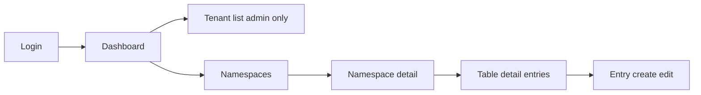

# UI design — Generic multi-tenant lookup service

Information architecture, key screens, **table-detail** search UX, and **empty/error** states. The reference UI in the monorepo is [**`apps/web`**](../../apps/web) (**Angular**, standalone components, **Angular Material**). Use a **dev-server proxy** to `/lookup/v1` so the browser avoids CORS against the API (see [implementation.md](./implementation.md)).

---

## Personas

- **Platform admin:** Creates and suspends **tenants** (optional module; may be a separate “Admin” app).
- **Tenant user:** Manages **namespaces**, **lookup tables**, and **entries** within an authorized tenant.

---

## Sitemap



| Route (example) | Screen | Purpose |
|-----------------|--------|---------|
| `/login` | Login | Authenticate; receive JWT. |
| `/` or `/dashboard` | Dashboard | Entry point; show tenant context and shortcuts. |
| `/admin/tenants` | Tenant admin | List/create/edit/suspend tenants (platform admin only). |
| `/t/:tenantId/namespaces` | Namespace list | CRUD namespaces. |
| `/t/:tenantId/namespaces/:namespaceId` | Namespace detail | List tables in namespace; create table. |
| `/t/:tenantId/namespaces/:namespaceId/tables/:tableId` | **Table detail** | Entry grid, search, CRUD entries, **version** selector, **import**, **audits**, **deprecation** state. |
| `/t/.../tables/:tableId/settings` (modal or tab) | Table settings | Deprecation toggle, **deprecated at** / **expires at** (optional). |
| `/t/.../tables/:tableId/import` (modal) | Bulk import | Excel upload (`new_version` vs `overwrite_current`); optional **sheet name**. |
| `/t/.../tables/:tableId/bulk-json` (modal) | Bulk JSON | Paste or upload JSON array; **`POST .../entries/bulk`**. |
| `/t/.../tables/:tableId/audits` (tab) | Import audit list | History of bulk uploads; link to detail. |

---

## Global shell

- **Top navigation:** product name, **tenant selector** (if `tenantIds` length > 1), user menu (logout).
- **Breadcrumb** on all managed screens: `Tenant name / Namespace name / Table name` (use display names; link each segment). Optionally append **version** badge when viewing a non-current version.
- **403 / wrong tenant:** clear message and link back to tenant picker or dashboard.

---

## Namespace list

- **Primary CTA:** “Create namespace” (modal or page).
- **Table columns:** Name, slug, table count (if API provides or lazy-load), updated, actions (edit, delete).
- **Delete:** Confirm dialog; if API blocks delete when tables exist, show API error inline.

---

## Namespace detail (tables)

- **Cards or table** of lookup tables: name, slug, entry count (optional), updated.
- **Deprecation:** badge **Deprecated** when `isDeprecated`; show **Expires** (`expiresAt`) if set; **Expired** when API **`isExpired`** is true (or compute: `expiresAt` set and now UTC >= `expiresAt`).
- **Filters:** toggle **Hide deprecated** / **Hide expired** mapped to `GET .../tables?includeDeprecated` / `hideExpired` (see OpenAPI; **`hideExpired`** matches **`isExpired`** predicate).
- **Soft delete:** optional **Trash** view with **`includeDeleted=true`**; **Restore** via `POST .../restore`; **Permanent delete** for operators only.
- **Primary CTA:** “Create table”.

---

## Table detail (entries) — core UX

### Deprecation and sunset

| State | UI |
|-------|-----|
| **Active** | No banner; full mutations if current version selected (and not soft-deleted). |
| **Deprecated, not expired** | Warning banner: “This table is deprecated.” **`isDeprecated` alone does not block writes** in the default API—mutations remain enabled until **expiry** (see below). |
| **Expired** (`isExpired` or `expiresAt` set and now UTC >= `expiresAt`) | Error-styled banner: “This table has expired.” **Disable** add/edit/delete entry, **Import Excel**, **JSON bulk**, and **Create version**; align with **403** / **410** (pick one status per deployment). **Reads**, **export**, and **version history** remain enabled (export for DR). |

### Table settings (deprecation and schema)

- **Mark deprecated:** checkbox `isDeprecated`; when checked, set **`deprecatedAt`** to now (server-authoritative) unless back-dating is supported.
- **Expires at:** optional datetime (UTC) `expiresAt`; validate **expires at >= deprecated at** before save.
- **Clear deprecation:** set `isDeprecated` false and clear dates (per `PATCH` merge semantics in OpenAPI).
- **Value JSON Schema (advanced):** textarea for table **`valueSchema`** (draft 2020-12); client validates where possible; server returns **422** on mismatch.
- On save: `PATCH .../tables/{tableId}`; surface **400** for invalid date order.

### Version selector

| Control | Behavior |
|---------|----------|
| **Version dropdown** | Load `GET .../tables/{tableId}/versions`; show `versionNumber`, optional `label`, date. **Current** marked (matches table `currentVersionId`). |
| **Default** | Current version: full toolbar including **Add entry**, **Edit**, **Delete**, **Import** — **unless table is expired** (then read-only). |
| **Historical version** | Read-only grid: hide add/edit/delete; pass `versionId` on `GET .../entries` (including key lookups like `?key=&pageSize=1`). Show banner: “Viewing version N (read-only).” |

### Tabs (optional layout)

- **Entries** — default.
- **Versions** — same as dropdown + optional “Create version from current” (`POST .../versions`) for power users.
- **Import history** — table from `GET .../imports`; row opens audit detail (`GET .../imports/{auditId}`).

### Toolbar

| Control | Behavior |
|---------|----------|
| **Version** | See version selector (can live in toolbar or sub-header). |
| **Search: key** | Text input; **exact** match on key (calls `GET .../entries?key=`; include `versionId` when not current). |
| **Search: value** | Text input; used with match mode. |
| **Match mode** | `Exact` / `Contains (partial)` — maps to `valueMatch=exact` \| `partial`. |
| **Case sensitive** | Checkbox; maps to `caseSensitive` (default **off**). |
| **Clear filters** | Resets inputs and reloads first page. |
| **Add entry** | Opens entry editor (**current** version only). |
| **Import Excel** | Opens bulk import modal. |
| **Bulk JSON** | Opens modal or drawer posting `POST .../entries/bulk` (mode + items array). |
| **Export** | Download **`GET .../exports`**; offer **`format`:** **Wide**, **Key/Value** (`kv`), or **Flat object (tabular)** (`flat_object` — columns `key`, top-level object fields, `_scalar`). Default product choice can favor **flat_object** for object-shaped values. |

**String-only hint:** When **Contains** is selected, show helper text: “Partial match applies to **string** values.” If API returns **422** for unsupported type filter, show toast with message from `ApiError.message`.

### Advanced search (optional)

- For power users, **`POST .../entries/search`** accepts a recursive **`query`** tree: **AND** / **OR** over leaves **`keyExact`**, **`keyPrefix`**, **`valueRoot`** (root string / `valueString`), **`valuePath`** (nested dot path). See OpenAPI and [README.md](./README.md) search summary.
- The default toolbar above stays mapped to **`GET .../entries`** query params for simplicity.

### Grid

- Columns: **Key**, **Value** (truncated with expand), **Updated**, **Actions** (edit, delete).
- **Value preview:** Strings plain; objects/arrays show compact JSON with syntax-safe truncation.
- **Pagination:** `page` / `pageSize` with max (e.g. 100) aligned with API; for very large tables use **cursor** + **Load more** (`cursor`, `limit`, `meta.nextCursor`).

### Entry editor (modal or side panel)

- **Key:** required text field; validate non-empty.
- **Value:** textarea for JSON **or** simple mode (string/number toggles) — phase 1 can be **JSON only** with client-side JSON.parse validation before POST/PATCH.
- **Save:** `POST` or `PATCH`; on **409** duplicate key, inline error on key field.

### Optional: get by key shortcut

- Link “Open by key” or use `GET .../entries?key={key}&pageSize=1` (URL-encode the key as a query value when needed).

---

## Bulk import (Excel) — modal

| Field / control | Behavior |
|-----------------|----------|
| **File** | `.xlsx` only; client-side max-size hint aligned with API. |
| **Format** | Radio: **Wide** (row 1 = keys, row 2 = values) vs **Key/Value** (`Key`, `Value` columns, many rows) vs **Flat object** (`flat_object`: row 1 = `key` + one column per top-level `value` field + `_scalar`). Link to downloadable templates. |
| **Sheet name** | Optional (advanced); default **first worksheet** in file. |
| **Mode** | Radio: **New version** (default) vs **Overwrite current**. Short helper: new version preserves history; overwrite replaces entries on current version only. |
| **Version label** | Optional text when mode is **New version** (maps to API `versionLabel`). |
| **Submit** | `POST .../imports` multipart. |
| **Async** | If response **202**, show “Queued” with `auditId` and **Poll** / auto-refresh until `succeeded` \| `failed` \| `partial`. |
| **Sync** | If **200**, show summary: keys parsed, entries written, warnings/errors list; refresh grid and version list. |

**Errors:** Invalid cell references (duplicate headers, empty key column) should display `details` from `ImportAuditRecord` with **cell** (e.g. `Sheet1!B2`).

---

## Import audit detail (drawer or page)

- **Header:** filename, started/completed time, actor (`actorSub`), status chip.
- **Body:** `mode`, `format`, `previousVersionId` → `resultingVersionId`, `stats`, expandable **details** list.
- **Partial success:** status `partial`; list errors and optionally “Download error report” (future).

---

## Empty states

| Location | Message | CTA |
|----------|---------|-----|
| No namespaces | “No namespaces yet” | Create namespace |
| No tables in namespace | “No lookup tables in this namespace” | Create table |
| No entries | “No entries in this table” | Add entry \| **Import Excel** |
| Search no results | “No entries match your filters” | Clear filters |
| No import history | “No bulk imports yet” | Import Excel |

---

## Error states

| Situation | UI treatment |
|-----------|----------------|
| **401** | Redirect to login; preserve return URL. |
| **403** | Full-page or inline: “You don’t have access to this tenant.” If `code` is **`TABLE_EXPIRED`**, show table lifecycle message (writes blocked) and link to settings. **`TABLE_DEPRECATED`** is reserved for a future strict mode — do not assume writes are blocked from deprecation alone. |
| **404** | “Resource not found” with link up breadcrumb. |
| **409** | Duplicate slug or key — field-level or toast. |
| **410** | Same messaging as **expired** table if API uses **Gone**; pick **403 or 410** consistently per deployment. |
| **422** | **`VALIDATION_ERROR`** — field-level or inline list (e.g. **`valueSchema`**, bulk JSON item); search “not applicable” — explain string-only partial match. |
| **429** | Toast: “Too many requests”; optional retry backoff (common on **import** rate limit). |
| **202** (import) | Not an error; show queued import and poll audit endpoint. |
| **5xx** | Generic failure; offer retry. |

---

## Critical user flows (for acceptance / demo)

1. **Platform admin:** Create tenant → copy tenant id for handoff.
2. **Tenant user:** Open tenant → create namespace → create table.
3. **Tenant user:** Add several entries (string and non-string values).
4. **Tenant user:** Filter by **exact key**; filter value **exact** and **contains** on **string** values.
5. **Tenant user:** Edit entry; delete entry; delete table with confirm.
6. **Tenant user:** **Import** wide Excel as **new version**; confirm new **current** version in dropdown.
7. **Tenant user:** **Import** as **overwrite current**; verify entries replaced; open **Import history** and inspect audit (actor, mode, stats).
8. **Tenant user:** Select **older version** in dropdown; confirm grid is read-only and search uses `versionId`.
9. **Tenant user:** Mark table **deprecated** with a future **expires at**; see banner and list badge; **before expiry**, mutations remain enabled (default API: **`isDeprecated`** does not block writes).
10. **Tenant user:** After **expiry**, confirm **writes** blocked (403 or 410) and UI disables **import**, **bulk JSON**, and entry edits; **reads** and **export** still work.
11. **Tenant user:** **Lift deprecation** or **extend expires at** via table settings; confirm mutations work again.
12. **Tenant user:** **Export** current or pinned version as `.xlsx` (**wide**, **kv**, or **flat_object** tabular).
13. **Tenant user:** **Bulk JSON** upsert (new version or overwrite); see audit row with **`format: json`**.
14. **Tenant user:** Large table: **Load more** via **cursor** pagination until `nextCursor` is null.
15. **Operator:** Soft-delete a table or namespace, **restore** from trash, or **permanent delete** when allowed.
16. **Tenant user:** Set **`valueSchema`** on a table; save invalid **value** → **422** with details; fix and retry.

---

## Wireframe (logical)

```mermaid
flowchart TB
  subgraph tableDetail [Table detail view]
    nav[Top nav with tenant selector]
    bc[Breadcrumb Tenant / NS / Table]
    tabs[Entries | Versions | Import history]
    ver[Version selector current or historical]
    row1[Key value search Import Export Bulk JSON Add entry]
    grid[Data grid with pagination]
  end
  nav --> bc --> tabs
  tabs --> ver --> row1 --> grid
```
